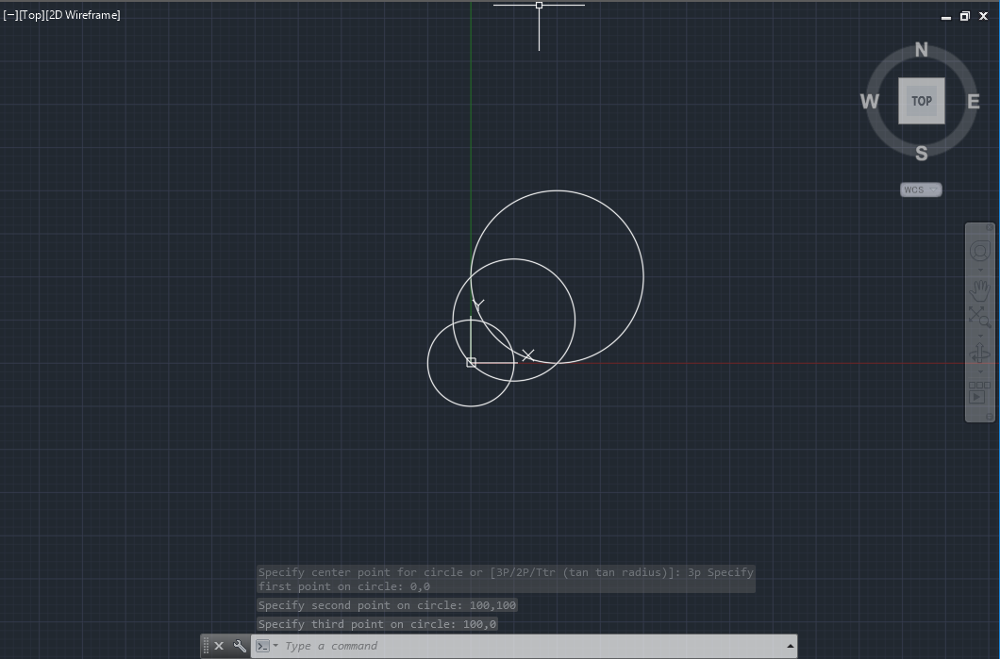

# AutoCADでスクリプトを使って自動作図する

　以前Qiitaに投稿した記事の使い回しです（笑）。

　CADで図面描いてて「同じような図面描くの面倒だなぁ」「大量の座標データを流し込めないかなぁ」ってなったときの裏ワザを紹介します。
いくつかのチームさんから「三面図この方法で描いてるよ」って聞いたことがあるので、裏ワザってほどでもないかもですが。。

　この記事はAutoCADが対象です。
他のソフトでできるのかはちょっとわからないので、また調べてみてください。

# やり方

　方法はいたって簡単。
AutoCADコマンドを書き溜めて、コマンドライン↓にコピー&ペーストするだけ！


　クリップボードにコピーするだけなので、エディタはメモ帳でもなんでもいいです。

　※本来、AutoCADにはコマンドスクリプトという機能(`.scr`ファイルの中のコマンドを実行する)があるようなのですが、コマンドラインに直打ちするときとは微妙に挙動が異なるようです(設定のせいかもしれない)。
調べた限り作図に応用している例も見当たらなかったので今回は諦めました。

# Scriptを書くときの注意点

1. `<Enter>`と`<Space>`はどちらも同じ効果
  * スクリプトを書くときは見やすくなるように使い分けるといいと思います。
1. `<Esc>`は使えない
  * 無理やり初期状態に戻すことはできません。
1. コマンドが実行されていないときに `<Enter>`と`<Space>`を押すと最後に実行されたコマンドが再開される
  * 適当に`<Enter>`・`<Space>`入れとけば初期状態に戻るだろ！とか言ってるとひどい目に逢います。
1. `INSERT`のように途中でダイアログが表示されるコマンドは`-INSERT`などの代替コマンドが用意されているのでそちらに置き換える
  * まああんまり使わないでしょうが。。
1. 存在しないコマンドを打っても無視される
  * なのでスクリプト中に「`--コメント`」とかコメントを残すこともできます。

# 実際に描いてみる

　それでは基本図形から描いてみましょう。

　以下「`↩︎`」は`<Enter>`1回で改行していることを示しています。

## 円

まずは`CIRCLE`コマンドで円を描いてみます。

```draw_circles.txt
--(100,100)を中心にした半径100の円↩︎
circle 100,100 100↩︎
--(0,0)を中心にした直径100の円↩︎
circle 0,0 d 100↩︎
--3点(0,0)(100,100)(100,0)を通る円↩︎
circle 3p 0,0 100,100 100,0↩︎

```


## 直線

　次に`LINE`コマンド。このコマンドは連続して点を打ち続けられるものなので、最後の座標の後に「座標打ち終わったよ」「コマンド終了するよ」の2回分の適用操作(`<Enter>`or`<Space>`)が必要です。**各行の最後に空白が1つ入っていることに注意してください。**
　スプラインとして描きたければコマンドを`PLINE`に変えればOKです。

```draw_lines.txt
--1本目、続けて2本目
line 0,0 200,20 240,-200 ↩︎
--3本目
line 0,40 200,60 ↩︎

```


## スプライン

　`LINE`と同じ要領ですが、接線ベクトルやクローズするなどのオプションが選択できます。最後にオプションを使うときは末尾の`<Space>`は必要ありません。

```draw_spline.txt
--山型に
spline 0,0 200,200 400,0 ↩︎
--裾を広げて
spline 0,0 t 1,0 200,200 400,0 t 401,0
--閉じたスプライン
spline 0,200 200,0 0,-200 c

```


## 移動・コピー

　`COPY`や`MOVE`といったコマンドでは対象のオブジェクトを選択する必要があります。選択操作には`SELECT`コマンドと同じオプションが使えるようです。詳しくは公式ドキュメントを参照してください。

[https://knowledge.autodesk.com/ja/support/autocad/learn-explore/caas/CloudHelp/cloudhelp/2015/JPN/AutoCAD-Core/files/GUID-0DD5DA73-9DC5-4424-8FED-7BBE3BE52A4D-htm.html](https://knowledge.autodesk.com/ja/support/autocad/learn-explore/caas/CloudHelp/cloudhelp/2015/JPN/AutoCAD-Core/files/GUID-0DD5DA73-9DC5-4424-8FED-7BBE3BE52A4D-htm.html)

　下の例では先ほど描いたスプラインをコピー・移動しています。`<Space>`が2つ並んでいるところまでがオブジェクト選択部分で、そのあと移動元の基点・移動先の基点を指定しています。`COPY`はコピー先を複数指定できるコマンドなので最後に`Exit`で閉じてあげましょう。

```move_copy_spline.txt
--draw_spline.txtの続き↩︎
--(200,0)周辺を通っているスプラインを選択して左に100移動させる(base:(0,0)->(-100,0))↩︎
move 200,0  0,0 -100,0↩︎
--(-10,-10)-(410,210)の窓に収まっているスプラインを選択して(-100,210)ずらしたところにコピーする↩︎
copy w -10,-10 410,210  0,0 -100,210 e↩︎

```


## Excel上の座標データからスプラインを作成する
　ここから応用編。まずはExcel上の座標データからスプラインを描く方法。

　Excel関数の文字列結合を使って「x,y」の形にします。


　あとはその列をエディタにコピーし、先頭に`SPLINE`、末尾に`<Enter><Enter>`を入れれば完成。`SPLINE`コマンドはデフォルトで`FIT CURVE`が選択されているので、きちんと指定した座標点を通ってくれます。

```draw_naca4412.txt
spline↩︎
75,0.13↩︎
70,1.47↩︎
65,2.71↩︎
55,4.89↩︎
45,6.69↩︎
35,8.14↩︎
25,9.19↩︎
15,9.8↩︎
5,9.76↩︎
0,9.41↩︎
-5,8.8↩︎
-10,7.89↩︎
-15,6.59↩︎
-17.5,5.76↩︎
-20,4.73↩︎
-22.5,3.39↩︎
-23.75,2.44↩︎
-25,0↩︎
-23.75,-1.43↩︎
-22.5,-1.95↩︎
-20,-2.49↩︎
-17.5,-2.74↩︎
-15,-2.86↩︎
-10,-2.88↩︎
-5,-2.74↩︎
0,-2.5↩︎
5,-2.26↩︎
15,-1.8↩︎
25,-1.4↩︎
35,-1↩︎
45,-0.65↩︎
55,-0.39↩︎
65,-0.22↩︎
70,-0.16↩︎
75,-0.13↩︎
↩︎

```


　おお！翼型！(後縁調整してないのはご愛敬)

## Scaleを変えながら大量コピー

　最後に、翼型のスケールを変えながらコピーを量産する例。AutoCADでは`ScaleCopy`ができないので、`Copy`->`Scale`で対応します。


```scale_copy.txt
--桁中心を原点に翼型を描く(Excelで座標を調整した)↩︎
spline↩︎
750,-38.7↩︎
700,-25.3↩︎
650,-12.9↩︎
550,8.9↩︎
450,26.9↩︎
350,41.4↩︎
250,51.9↩︎
150,58↩︎
50,57.6↩︎
0,54.1↩︎
-50,48↩︎
-100,38.9↩︎
-150,25.9↩︎
-175,17.6↩︎
-200,7.3↩︎
-225,-6.1↩︎
-237.5,-15.6↩︎
-250,-40↩︎
-237.5,-54.3↩︎
-225,-59.5↩︎
-200,-64.9↩︎
-175,-67.4↩︎
-150,-68.6↩︎
-100,-68.8↩︎
-50,-67.4↩︎
0,-65↩︎
50,-62.6↩︎
150,-58↩︎
250,-54↩︎
350,-50↩︎
450,-46.5↩︎
550,-43.9↩︎
650,-42.2↩︎
700,-41.6↩︎
750,-41.3↩︎
↩︎
--桁穴を描く
circle 0,0 35↩︎
--(0,250)間隔で9個Copy↩︎
copy crossing 0,0 1000,0  0,0 0,250 0,500 0,750 0,1000 0,1250 0,1500 0,1750 0,2000 0,2250 0,2500 e↩︎
--桁穴を避けるように外側だけ選択し桁穴を中心にそれぞれの縮小率で縮小↩︎
scale crossing 100,250 1000,250  0,250 0.98↩︎
scale crossing 100,500 1000,500  0,500 0.96↩︎
scale crossing 100,750 1000,750  0,750 0.94↩︎
scale crossing 100,1000 1000,1000  0,1000 0.92↩︎
scale crossing 100,1250 1000,1250  0,1250 0.9↩︎
scale crossing 100,1500 1000,1500  0,1500 0.88↩︎
scale crossing 100,1750 1000,1750  0,1750 0.86↩︎
scale crossing 100,2000 1000,2000  0,2000 0.84↩︎
scale crossing 100,2250 1000,2250  0,2250 0.82↩︎
scale crossing 100,2500 1000,2500  0,2500 0.8↩︎

```


　たのしい！
　スケールを変えたくないものはうまく拘束してやるか、すべてスクリプトで描いてしまうかですね。

# まとめ
　以上、AutoCADでスクリプトベースの作図をする方法をかるくご紹介しました。今回の例のように繰り返し処理が多い図面を描くときに知っておくと作業負担を減らせるかなと思います。また、このようなスクリプトはExcelやプログラミング言語と相性がいいので、工夫すれば作図の大部分を自動化できるのではないかと思います。

　内容に間違いなどありましたら教えていただけると幸いです。

# おまけ

　AutoCADではプラグイン開発用にC++/LISP/.Net言語/JavaScript向けのAPIが用意されているようです。
この辺りの仕様を理解すれば複雑な作業も自動化できそう（そこまでやるか感…）。

　おしまい。
