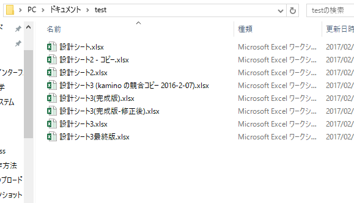

# ファイルの履歴を管理する（Git）

　作業中に「間違えて上書き保存してしまった」「間違った変更を戻せなくなった」「バックアップを取ったもののどれがどれだかわからなくなった」なんて経験ありませんか？
ちゃんとファイル管理をしようとするとなかなか手間がかかりますよね。

←見覚えのある光景

　特に大量のソースコードを複数人で管理するプログラマたちにとってファイルのバックアップは深刻な問題でした。
そこで昨今のIT業界ではGit（ギット）というツールを使うのがスタンダードになりつつあります。
これがかなり便利なツールなので、電装班や設計者向けにオススメ記事を書いてみようと思います。

## Gitとは

　Gitは2005年にLinus TorvaldsがLinux（有名なフリーOS）の開発を補助するためのツールとして開発したソフトです。
もともとLinuxの開発には別の有料サービスを使っていたらしいのですが、ライセンス関係でもめた末に「自作したらええやん」と言い放ったLinusさんが2週間でコア機能を実装してきたらしいです（バケモノかよ）。
最近はGitHubとかGitLab（2月くらいにデータベース吹っ飛ばして話題になりました）を使う人も増えてきたので知っている人もいるかもしれませんね。

## なにができるの？

　Gitを使うと次のようなことができるようになります。

* ファイルの変更履歴を残す
* いつでも昔の状態に戻したり、最新の状態に戻ってきたりする
* 複数のバージョンに分岐させる
* 分岐させたバージョンを後から統合する（テキストファイルのみ）
* 変更の差分を見る（テキストファイルのみ）

## どうやったら使えるの？

　単に使うだけなら公式サイト（[https://git-scm.com](https://git-scm.com)）からインストーラーをダウンロードしてくるだけでOKです。
ググればインストール記事がいっぱい出てくるので、それを見ながら操作していけば無事にインストールできると思います。

　一応、よさげな記事をご紹介。

* Mac : [https://git-scm.com/book/ja/v2/使い始める-Gitのインストール](https://git-scm.com/book/ja/v2/使い始める-Gitのインストール)
  * Macは特にややこしい設定はないので公式ページのダウンロードリンクからインストーラーをダウンロードしましょう。

* Windows : [https://qiita.com/taipon_rock/items/632c117220e57d555099](https://qiita.com/taipon_rock/items/632c117220e57d555099)
  * Git for Windowsという、Git + Windowsでスムーズに使うための設定・アプリが付属したパッケージをインストールします。
  * 改行コードなど若干ややこしい設定がありますが、とりあえずこのページの通りにやっておけば問題ないです。
  * コマンドラインがわからない人もとりあえずこれを読んでインストールしましょう。

----------

　さて。
インストールしたGitを使うには大きく分けて2つの方法があります。

1. shellなどのコマンドラインツールから使う
2. GUI（グラフィックユーザーインターフェース）付属のクライアントアプリから使う

　前者は、コマンドを覚える必要があるかわりにGitの全ての機能を自由に使うことができます。
後者は、画面内のボタンをクリックするだけでGitを操作できますが、ボタンとして用意されていない機能を使うことができません。

　イメージ

[TODO]画像貼る

　深入りしない限りは後者で十分ですが。。
Gitをマスターするならコマンドラインツールから使う方がおすすめなので、ここでは両方のパターンをざっと紹介しましょう。

## パターン１：shellから使う

　まずは適当なコマンドラインツールを開きます。
Macなら**ターミナル**、Windowsなら**コマンドプロンプト**もしくはGit for Windowsで一緒にインストールされている**Git Bash**を使うとよいと思います。
どのOSでもスタート画面を開いて検索すれば出てきます。

## パターン２：GUIクライアントアプリから使う

　まずは適当なクライアントアプリをインストールしましょう。
有名どころは**SourceTree**や**GitKraken**ですね。
どちらも公式サイトからインストーラーをダウンロードしてポチポチしていけばOKです。

なお、Git for Windowsを使ってインストールすると**Git GUI**なるクライアントアプリがついてくるのですが、スペックがゴミなのでここではスルーします。
